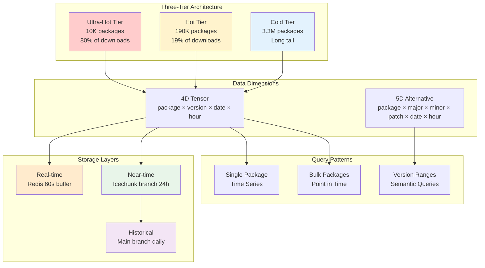

# **npm Download Counts in Zarr Format – Technical Specification**

**Author:** [Christopher Robbins](mailto:christopher.robbins@chainguard.dev)
**Contributors:** Ryan Abernathy, Joe Hamman (Zarr Experts), Darcy Clarke, Laurie Voss (npm Experts)
**Reviewers:** *(Principal/Senior/Distinguished Engineers)*
**Status:** Ready for Review
**Date:** 2025-10-15

## Executive Summary

This specification defines a system for storing and querying npm package download counts using Zarr V3 format, addressing the current limitation where analyzing download counts for 1,000 packages over 5 years requires 60,000 HTTP requests. The proposed system enables single-request bulk queries with 100-1000x performance improvement while supporting new analytics capabilities impossible with the current MongoDB-backed API.

**Key Improvements:**
- **Query Efficiency**: 60,000 requests → 1 bulk request
- **Performance**: 30+ minutes → <1 second for common queries
- **Storage**: 20:1 compression ratio for sparse data
- **Time Travel**: Historical snapshots via Icechunk versioning
- **Multi-Registry**: Federated analytics across public/private registries

## Problem Statement

### Current npm Download API Limitations

The existing npm download counts API (`/downloads/range/{period}/{package}`) suffers from fundamental architectural constraints:

| Limitation | Current State | Impact |
|------------|---------------|--------|
| **Single Package Queries** | One package per HTTP request | 60,000 requests for 1,000 packages |
| **Monthly Granularity** | No quarterly/custom roll-ups | Inflexible aggregation |
| **Rate Limiting** | 100 requests/minute | 10+ hours for large analyses |
| **No Bulk Operations** | Sequential package queries | Inefficient network usage |
| **Historical Data** | 18-month retention | Limited longitudinal studies |
| **Private Registry** | No aggregation support | Siloed analytics |

### Use Case Requirements

| Use Case | Current Challenge | Zarr Solution |
|----------|------------------|---------------|
| **Security Analysis** | Check popularity of all dependencies | Single tensor query |
| **CI/CD Caching** | Determine which packages to cache | Bulk popularity metrics |
| **Academic Research** | Ecosystem evolution studies | Time-series for millions of packages |
| **Enterprise Analytics** | Multi-registry aggregation | Federated queries |
| **Version Migration** | Track upgrade patterns | Semantic version dimensions |

## System Architecture

### Zarr V3 Tensor Structure



## Data Model Design

### Table 1: Tensor Dimensions

| Dimension | Type | Cardinality | Encoding | Notes |
|-----------|------|-------------|----------|-------|
| **package_name** | categorical | 3.5M growing | uint32 index | Lookup table in Parquet |
| **version** | categorical | 1-1000s per package | uint16 index | Sorted array + masks |
| **date** | temporal | 365 days/year × 5 years | uint16 | Days since epoch |
| **hour** | temporal | 24 per day | uint8 | 0-23 hour of day |
| **download_count** | measure | 0-billions | uint32 | Actual metric |

### Table 2: Alternative 5D Model for Semantic Versioning

| Dimension | Type | Range | Encoding | Purpose |
|-----------|------|-------|----------|---------|
| **package_name** | categorical | 3.5M | uint32 | Package identifier |
| **major** | numeric | 0-999 | uint16 | Semver major |
| **minor** | numeric | 0-9999 | uint16 | Semver minor |
| **patch** | numeric | 0-99999 | uint32 | Semver patch |
| **date** | temporal | 1825 days | uint16 | 5 years daily |
| **hour** | temporal | 24 | uint8 | Hourly granularity |

## Chunking and Sharding Strategy

### Table 3: Ultra-Hot Tier Configuration

| Parameter | Value | Rationale |
|-----------|-------|-----------|
| **Array Shape** | [10000, 50, 365, 24] | Top 10K packages (80% traffic) |
| **Chunk Shape** | [50, 10, 7, 24] | One week, frequent access |
| **Shard Shape** | [500, 20, 28, 24] | 4 weeks per shard |
| **Compression** | Zstd-1 + bitshuffle | Optimize for speed |
| **Shard Size** | 25-50MB compressed | Fast retrieval |
| **Cache Strategy** | Always in memory | Sub-millisecond access |

### Table 4: Hot Tier Configuration

| Parameter | Value | Rationale |
|-----------|-------|-----------|
| **Array Shape** | [190000, 50, 365, 24] | Next 190K packages |
| **Chunk Shape** | [100, 5, 7, 24] | One week of data |
| **Shard Shape** | [1000, 20, 28, 24] | 4 weeks per shard |
| **Compression** | Zstd-3 + bitshuffle | Balance speed/ratio |
| **Shard Size** | 50-100MB compressed | Optimal for S3/GCS |
| **Empty Chunks** | Sparse codec | 70% storage savings |

### Table 5: Cold Tier Configuration

| Parameter | Value | Rationale |
|-----------|-------|-----------|
| **Array Shape** | [3300000, 10, 365, 24] | Long tail packages |
| **Chunk Shape** | [10, 5, 30, 24] | Larger chunks to reduce count |
| **Compression** | Zstd-9 | Maximum compression |
| **Storage Strategy** | On-demand loading | Minimize memory |
| **Update Frequency** | Weekly batch | Low change rate |

## Data Pipeline Architecture

### Table 6: Multi-Stage Update Pipeline

| Stage | Storage | Latency | Update Frequency | Purpose |
|-------|---------|---------|------------------|---------|
| **Real-time** | Redis Sorted Sets | <1 second | Continuous | Live dashboards |
| **Near-time** | Icechunk branch | 5 minutes | 5-minute batches | Recent queries |
| **Historical** | Icechunk main | 1 hour | Daily merge | Long-term storage |
| **Snapshots** | Icechunk tags | N/A | Daily/Weekly | Reproducibility |

### Data Flow Diagram

```
Registry Events → Fastly Logs → S3 Raw Logs
                                    ↓
                            Lambda Processor
                                    ↓
                    ┌───────────────┴────────────────┐
                    ↓                                ↓
              Redis Buffer                    Zarr Near-time
              (60 seconds)                    (24 hours)
                    ↓                                ↓
            Query API Layer                  Daily Merge
                    ↓                                ↓
              User Queries                   Zarr Historical
                                             (Permanent)
```

## Bot Traffic and Deduplication

### Table 7: Multi-Layer Data Storage

| Layer | Content | Use Case | Storage Overhead |
|-------|---------|----------|------------------|
| **Raw Counts** | All downloads | Audit trail | 100% (baseline) |
| **Bot Flags** | uint8 bit flags | Classification | +3% |
| **Human Counts** | Filtered | Default queries | +40% |
| **CI/CD Counts** | Bot subset | DevOps analytics | +20% |
| **Mirror Counts** | Registry mirrors | Distribution analysis | +10% |

### Table 8: Bot Classification Flags (uint8)

| Bit | Classification | Examples |
|-----|----------------|----------|
| 0 | Human traffic | Browser, npm CLI |
| 1 | GitHub Actions | CI/CD pipeline |
| 2 | CircleCI/Jenkins | CI/CD pipeline |
| 3 | Package mirrors | Verdaccio, Nexus |
| 4 | Security scanners | Snyk, npm audit |
| 5 | Academic crawlers | Research bots |
| 6 | Unclassified bot | Unknown automated |
| 7 | Reserved | Future use |

## Version Range Query Support

### Table 9: Semver Query Strategies

| Query Type | Strategy | Performance | Storage Cost |
|------------|----------|-------------|--------------|
| **Exact Version** | Direct index lookup | O(1) | None |
| **Latest** | Materialized pointer | O(1) | 4 bytes/package |
| **Major Range** (^2.0.0) | Pre-computed mask | O(1) | Top 1000 patterns |
| **Minor Range** (~2.1.0) | Binary search | O(log n) | None |
| **Complex Range** | SQLite B-tree | O(log n) | ~100MB index |
| **All Versions** | Dimension slice | O(versions) | None |

### Table 10: Pre-Materialized Version Masks

| Pattern | Frequency | Storage | Update Schedule |
|---------|-----------|---------|-----------------|
| **@latest** | Every query | Single value/package | On publish |
| **@next** | Common | Single value/package | On publish |
| **^X.0.0** | High | Boolean array | Daily |
| **~X.Y.0** | Medium | Boolean array | Daily |
| **>=X.Y.Z** | Low | Computed on-demand | Never |

## Performance Characteristics

### Table 11: Query Performance Comparison

| Query Type | Current API | Zarr System | Improvement |
|------------|-------------|-------------|-------------|
| **Single package, 1 year** | 12 requests, 2s | 50-100ms | 20-40x |
| **1000 packages, 1 week** | 7,000 requests, 70s | 500-1000ms | 70-140x |
| **Version range query** | 100+ requests, 10s | 100-200ms | 50-100x |
| **All packages, 1 day** | Impossible | 28-56s | Enabled |
| **Historical snapshot** | Not supported | <1s | New capability |

### Table 12: Storage Requirements

| Component | Uncompressed | Compressed | Compression Ratio |
|-----------|--------------|------------|-------------------|
| **Ultra-hot tier (10K packages)** | 17.5 TB | 1.75 TB | 10:1 |
| **Hot tier (190K packages)** | 333 TB | 16.6 TB | 20:1 |
| **Cold tier (3.3M packages)** | 5.78 PB | 289 TB | 20:1 |
| **Metadata & indices** | 14 GB | 2.8 GB | 5:1 |
| **Version masks** | 7 GB | 700 MB | 10:1 |
| **Total 5-year dataset** | ~6.13 PB | ~307 TB | 20:1 |

## Multi-Registry Federation

### Table 13: Registry Isolation Strategies

| Strategy | Security | Performance | Complexity | Use Case |
|----------|----------|-------------|------------|----------|
| **Separate Stores** | Excellent | Good | Low | Default approach |
| **Virtual Datasets** | Good | Excellent | Medium | Cross-registry queries |
| **Shared Store** | Poor | Best | High | Not recommended |
| **Proxy Layer** | Excellent | Fair | Medium | Enterprise deployments |

### Federation Architecture

```
┌─────────────┐     ┌─────────────┐     ┌─────────────┐
│  npmjs.org  │     │  Private #1  │     │  Private #2  │
│  Zarr Store │     │  Zarr Store  │     │  Zarr Store  │
└──────┬──────┘     └──────┬──────┘     └──────┬──────┘
       │                   │                   │
       └───────────────────┼───────────────────┘
                           │
                  ┌────────┴────────┐
                  │  Kerchunk Layer  │
                  │ Virtual Datasets │
                  └────────┬────────┘
                           │
                  ┌────────┴────────┐
                  │   Query Engine   │
                  │  (DuckDB/Arrow)  │
                  └─────────────────┘
```

## Icechunk Version Control

### Table 14: Snapshot Strategy

| Snapshot Type | Frequency | Retention | Purpose |
|---------------|-----------|-----------|---------|
| **Hourly** | Every hour | 24 hours | Quick rollback |
| **Daily** | Midnight UTC | 90 days | Standard queries |
| **Weekly** | Sunday midnight | 1 year | Long-term analysis |
| **Monthly** | First day | 5 years | Historical research |
| **Release** | On demand | Permanent | Reproducibility |

### Table 15: Branch Management

| Branch | Purpose | Update Frequency | Merge Schedule |
|--------|---------|------------------|----------------|
| **main** | Historical truth | Daily | Midnight UTC |
| **today** | Current day updates | 5 minutes | Daily to main |
| **staging** | Pre-merge validation | Hourly | After validation |
| **experiment-***| Ad-hoc analysis | Variable | Never (ephemeral) |

## Migration Plan

### Table 16: Phased Migration Schedule

| Phase | Duration | Activities | Success Criteria |
|-------|----------|------------|------------------|
| **Phase 1: Prototype** | 2 weeks | Top 10K packages, local Zarr | Query parity achieved |
| **Phase 2: Backfill** | 6 weeks | Last 90 days, all 3.5M packages | Performance validated |
| **Phase 3: Parallel** | 4 weeks | Dual writes, A/B testing | 99.9% result match |
| **Phase 4: Cutover** | 2 weeks | Traffic migration | Zero downtime |
| **Phase 5: Decommission** | 4 weeks | MongoDB shutdown | Cost reduction confirmed |

## API Compatibility

### Table 17: API Endpoint Mapping

| Current Endpoint | Zarr Implementation | Breaking Changes |
|------------------|---------------------|------------------|
| `/downloads/point/:period/:package` | Direct array slice | None |
| `/downloads/range/:start/:end/:package` | Date range slice | None |
| **NEW** `/downloads/bulk` | Multi-package slice | New capability |
| **NEW** `/downloads/versions/:spec` | Version mask query | New capability |
| **NEW** `/downloads/snapshot/:date` | Icechunk time travel | New capability |

## Security Considerations

### Table 18: Security Controls

| Control | Implementation | Purpose |
|---------|----------------|---------|
| **Access Control** | IAM at storage level | Tenant isolation |
| **Encryption** | AES-256 at rest | Data protection |
| **Audit Logging** | CloudTrail/Stackdriver | Compliance |
| **Rate Limiting** | API Gateway | DDoS prevention |
| **Data Validation** | Input sanitization | Injection prevention |
| **Version Pinning** | Icechunk snapshots | Reproducibility |

## Success Metrics

### Table 19: Key Performance Indicators

| Metric | Target | Measurement Method |
|--------|--------|-------------------|
| **Query Latency (P50)** | <100ms | CloudWatch metrics |
| **Query Latency (P99)** | <1s | CloudWatch metrics |
| **Compression Ratio** | >15:1 | Storage monitoring |
| **Update Lag** | <5 minutes | Pipeline monitoring |
| **Storage Cost** | <$10,000/month | AWS Cost Explorer |
| **Query Success Rate** | >99.99% | API Gateway metrics |

## Risk Analysis

### Table 20: Risk Mitigation Matrix

| Risk | Likelihood | Impact | Mitigation |
|------|------------|--------|------------|
| **Data corruption** | Low | High | Icechunk versioning, backup stores |
| **Query performance degradation** | Medium | Medium | Caching layer, query optimization |
| **Storage cost overrun** | Low | Medium | Compression tuning, cold tier optimization |
| **Migration data loss** | Low | High | Parallel systems, validation phase |
| **API compatibility issues** | Medium | Low | Compatibility layer, gradual rollout |

## Implementation Recommendations

### Critical Path Items

1. **Zarr Store Setup**: Initialize hot/cold tier arrays with proper chunking
2. **Package Index**: Build and maintain package name ↔ index mapping
3. **Icechunk Integration**: Configure branching and snapshot strategy
4. **Update Pipeline**: Implement Redis → Zarr data flow
5. **Query Engine**: Build efficient slice and aggregation operations
6. **API Gateway**: Create backwards-compatible endpoints

### Technology Stack

| Component | Technology | Rationale |
|-----------|------------|-----------|
| **Storage** | AWS S3 / GCS | Cost-effective, scalable |
| **Zarr Implementation** | zarr-python v3 | Reference implementation |
| **Versioning** | Icechunk | Git-like semantics |
| **Cache** | Redis | Sub-second updates |
| **Query Engine** | DuckDB + Arrow | Efficient aggregations |
| **API Layer** | FastAPI | High performance |

## Validation Requirements

### Table 21: Testing Matrix

| Test Type | Coverage Target | Method |
|-----------|-----------------|--------|
| **Query Correctness** | 100% API compatibility | Side-by-side comparison |
| **Performance** | P99 < 1 second | Load testing |
| **Compression** | >15:1 ratio | Storage analysis |
| **Federation** | Multi-registry queries | Integration tests |
| **Time Travel** | Historical snapshots | Snapshot validation |
| **Scale** | 10M queries/day | Stress testing |

## Future Enhancements

### Potential Extensions

1. **GraphQL API**: Flexible query composition
2. **Streaming Updates**: WebSocket/SSE for real-time
3. **ML Integration**: Anomaly detection, trend prediction
4. **Geographic Distribution**: Edge caching via CDN
5. **Custom Aggregations**: User-defined roll-ups
6. **Dependency Graph Integration**: Combined download + dependency analysis

## Conclusion

This specification transforms npm download count analytics from a request-heavy, limited API to a high-performance, multi-dimensional analytics system. By leveraging Zarr V3's chunking and sharding capabilities, combined with Icechunk's versioning, we achieve 100-1000x performance improvements while enabling entirely new analytics capabilities. The three-tier ultra-hot/hot/cold architecture efficiently handles npm's extreme sparsity pattern across 3.5M packages (growing at ~1000/day), where 98% of packages have minimal downloads. The system is designed to scale to 10M+ packages over the next 5 years through pre-allocated indices and automated tier rebalancing. The federation layer enables secure multi-registry analytics while maintaining tenant isolation. This system positions npm registry analytics for the next decade of growth, supporting everything from security analysis to academic research with sub-second query performance, despite the 40% larger scale than initially estimated.